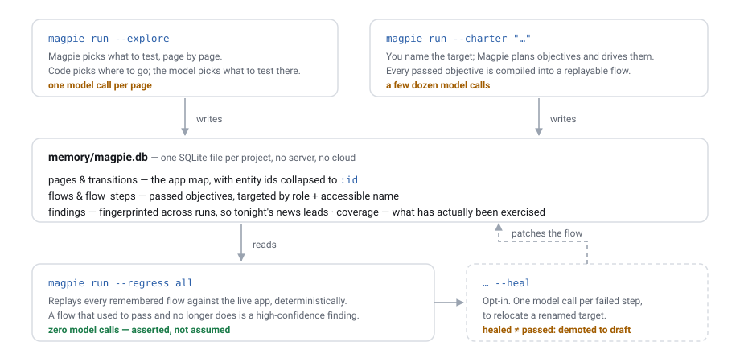

# Magpie

**The testing agent that remembers your app.**

[](https://github.com/Yusuf-Hridoy/Test-Agent/actions/workflows/ci.yml)
[](https://www.npmjs.com/package/magpie-qa)
[](LICENSE)

Magpie is an open-source, self-hosted web-testing agent that drives a real
Chromium browser and — unlike every generic browser agent — **keeps what it
learned**. Point it at an application and it explores, or tests a charter you
wrote; every passed objective is compiled into a replayable flow, every page it
walks lands in a per-project SQLite map, and every finding is fingerprinted so
tonight's report leads with what broke tonight. The expensive part happens
once: afterwards `magpie run --regress all` replays everything it knows against
the live app for **zero model calls**, and tells you which flow stopped working
and when it last passed. It runs entirely on **free-tier LLM APIs** (Gemini,
Groq, Mistral) — no paid key required.

---

## Install

```bash
npm install -g magpie-qa
npx playwright install chromium   # required, once — see the note below
```

Node ≥ 20 required.

> **The browser is a separate step on purpose.** Magpie runs **no** postinstall
> script, because installing a CLI should not quietly download 300 MB of
> Chromium. Run `npx playwright install chromium` yourself, once per machine
> (or once per CI image). Everything else is in the package.

## Quickstart (60 seconds, against the public Sauce Labs demo shop)

```bash
mkdir magpie-demo && cd magpie-demo
magpie init --name demo --url https://www.saucedemo.com

echo 'GOOGLE_GENERATIVE_AI_API_KEY=...' >> .env   # free key: https://aistudio.google.com/apikey
magpie login                                      # log in by hand, press Enter; saved to .auth/
magpie run --charter "Add the cheapest item to the cart and check the badge"
```

It narrates as it goes, then prints a summary:

```
magpie: demo — https://www.saucedemo.com
charter: Add the cheapest item to the cart and check the badge

checking session against https://www.saucedemo.com/inventory.html
session is alive
  O-01 [happy-path] Reach the product list
  O-02 [state-transition] Adding an item updates the cart badge

▶ O-01 Reach the product list
  [2/80] goto "/" → OK (/inventory.html)
  ✔ O-01 passed — product list is showing

▶ O-02 Adding an item updates the cart badge
  [6/80] click "Add to cart" → OK (/inventory.html)
  ! F-001 http_5xx (high): Server error: /api/cart
  ! O-02 finding — badge never updated

── COMPLETED ─────────────────────────────────────────────────
charter   Add the cheapest item to the cart and check the badge
budget    14/80 steps · 11/60 LLM calls · 2.4/20 min
providers gemini 11

objectives
  ✔ O-01   passed       Reach the product list
  ! O-02   finding      Adding an item updates the cart badge
      badge never updated

findings (1)
  F-001        high    http_5xx             high  Cart badge does not update

report    /path/to/magpie-demo/reports/2026-09-16_14-32-05/index.html
```

Every run leaves a folder you can attach to a ticket:

```
reports/2026-09-16_14-32-05/
  index.html        ← self-contained report; open it offline, mail it, attach it
  steps.jsonl       ← every step, appended as it happened (crash-safe)
  session.json      ← the machine-readable result
  flows.draft.json  ← passed objectives, compiled into memory as flows
  trace.zip         ← npx playwright show-trace trace.zip
  shots/            ← numbered screenshots
```

Then see what it learned, and replay it for free:

```bash
magpie memory show                   # pages, flows, sessions
magpie run --regress all             # replay every verified flow — 0 model calls
magpie dashboard                     # one offline page for the whole project
```

## How memory works



Generic agents test once and forget; every run re-discovers the app at full
token cost. Magpie writes what it learned to `<project>/memory/magpie.db` — one
SQLite file, no server, no cloud — and spends tokens only on ground it has not
covered.

- **The app map.** Every page seen, keyed by a normalized `host/path`, with its
  transitions and its element list. Entity ids collapse to `:id`
  (`shop.test/item/4711` → `shop.test/item/:id`), so a shop with 10 000 products
  maps to the size of a shop with one.
- **Flows.** Each passed objective becomes a replayable step list targeted by
  role + accessible name + position — never by a snapshot id, which dies with
  the session. A flow is `draft` when recorded, `verified` once a replay has
  proven it, `broken` when one fails.
- **Findings.** Fingerprinted across runs, so a nightly report leads with what
  is new and files the rest under *known, seen 4× since 2026-09-19*. Nothing is
  ever auto-closed: a finding that stops appearing is not thereby fixed.
- **Coverage.** Which elements have actually been interacted with, and which
  pages are linked but never opened.

**Replay costs nothing, and that is the whole economic argument.**
`magpie run --regress all` drives a real browser through recorded steps with no
model in the loop — the usage counter is *asserted* to be zero, not assumed. In
the Phase 2 acceptance run a 4-step checkout flow replayed in **2.0 s for 0
calls**, against ~73 model requests spent discovering it and two other sessions;
Phase 3 measured 2.1 s for a catalogue flow. A replay never guesses: if a step's
target matches zero elements — or more than one it cannot disambiguate — that is
a failure with a screenshot and a trace, not an invitation to click something
similar.

Later runs plan *against* memory. When a project has history, the planner gets a
short briefing — most-visited pages, verified flows, known high-severity
findings — with one rule: extend or vary known ground rather than re-test it
identically. A project with no memory sends exactly the prompt it always did, so
a first run against a new app is unchanged.

## The three modes

| Command | What it does | Costs |
|---|---|---|
| `magpie run --charter "…"` | Tests what you describe | a few dozen model calls |
| `magpie run --explore` | Tests what Magpie finds, page by page | one model call per page |
| `magpie run --regress all` | Replays every remembered flow | **nothing** |
| `magpie dashboard` | One offline HTML page: coverage, flows, defects, every run | nothing |
| `magpie memory coverage` | What has been exercised, and where to look next | nothing |
| `magpie flows verify <slug>` | Replay one flow and promote it to `verified` | nothing |

Full command and flag reference: **[docs/cli.md](docs/cli.md)**.
Exit codes: `0` ran (findings or not) · `1` a replay failed or was healed ·
`2` blocked / environment down · `3` auth or config problem.

## Recommended cadence

The three modes are a cycle, not alternatives — and the cheapest one runs most
often.

| When | Command | Costs |
|---|---|---|
| **Nightly**, in CI | `magpie run --regress all --fail-on-skipped --json` | nothing |
| **Per feature**, while you build it | `magpie run --charter "…"` | a few dozen calls |
| **Weekly**, against staging | `magpie run --explore` | a few dozen calls |
| **After either**, to prove a flow | `magpie flows verify <slug>` | nothing |

A useful rhythm on a new app: explore once to draw the map, read
`magpie memory coverage` to see what it found, write charters for the flows your
users actually care about, then let the nightly suite carry them.

Pass **`--fail-on-skipped`** in CI. A `broken` flow is *skipped*, not failed, and
skipping is not failing — without that flag a suite whose flows have all broken
exits `0` while testing nothing. See **[docs/ci.md](docs/ci.md)** for the GitHub
Actions recipe and the `suite.json` fields.

> **⚠ Explore against staging, not production.** Every other mode does what you
> asked; explore does what it decides. The only things between it and a page you
> did not want touched are `scope.exclude` and `forbidden_elements` — fill them
> in before the first exploratory run, and use an account whose damage you can
> absorb. The guards are enforced in code and every refusal is logged, but a
> guard cannot know that `/admin/rebuild-index` is expensive. Only you can.

## Security model

**Never leaves your machine:** your `.env`, saved sessions in `.auth/`, cookies,
tokens, `Authorization` headers, and anything typed into a password field.
Values typed into password inputs are registered as secrets *before* they are
typed, and every prompt, log line, step record and report is redacted against
that set. A masked value is stored in memory as the literal `{secret}` and
replay **refuses** to run that step rather than invent one. `magpie login`
deliberately discards its Playwright trace, so your password is never recorded.

**Sent to your LLM provider:** the charter, the current page's URL, title,
visible interactive elements (role, accessible name, non-password values), up to
2000 characters of page text, your recent tool results, and — only when the
model calls `look` — a screenshot. Snapshots are sent one at a time, never
accumulated.

**Refused outright:** clicking anything matching `forbidden_elements` (logout,
delete, billing, payment, purchase, subscribe…), and navigating outside
`scope.include`. Both are enforced in the browser layer, not by prompting, and
every refusal is logged as a step and returned to the model as an error.

**Free-tier note:** free LLM tiers generally reserve the right to train on what
you send. What Magpie sends is a redacted description of pages under test — but
if your staging data is sensitive, that is a decision to make deliberately. A
paid key from the same providers works unchanged.

## Honest limitations

Things Magpie does **not** do, stated plainly so you can judge it fairly:

- **No visual oracles.** It reads the accessibility tree and the network, not
  pixels. A layout that breaks without throwing an error, a mis-rendered chart,
  a wrong colour — it will not notice. Screenshots are evidence, not a baseline.
- **Healed is not passed.** `--heal` proves something similar is still on the
  page, not that the application still does what the flow asserts. A healed flow
  is reported HEALED, demoted to `draft`, and exits `1` on purpose.
- **Coverage is coverage of what it has found.** Magpie draws its own map, so
  the number is never a claim about the whole application. Every coverage output
  carries that sentence, and it is not boilerplate.
- **Discovery reads real `href`s.** On an app that navigates in JavaScript —
  every in-app link an `href="#"` — nothing is discovered ahead of time, and the
  map grows only as sessions actually walk pages. Traditional link navigation
  crawls properly.
- **`llm_judgment` findings are low-confidence by design**, and labelled as
  such. The high-confidence oracles are the mechanical ones: `crash`,
  `http_5xx`, `http_4xx_unexpected`, `console_error`, and `regression` — "this
  worked on Sunday and does not work today".
- **Free-tier rate limits are real.** Quotas are per model per day; Magpie paces
  calls (`model.min_delay_ms`, default 7 s), retries once on a quota error, then
  fails over to the next provider. A long exploratory session can still exhaust
  a free quota — `budget.max_llm_requests` is what stops it from trying.
- **One project, one app, one machine.** No multi-project view, no parallel
  replay, no server.

## Post-1.0 backlog

Deliberately not in 1.0, in rough priority order:

- `--resume` for a session interrupted mid-run (checkpoints already exist)
- `sitemap.xml` / `robots.txt` ingestion, and treating a click that changes the
  URL as a discovery — the fix for JS-navigated apps above
- Parallel flow replay for large suites
- Visual-diff oracles with an explicit baseline
- A multi-project dashboard, and a served (rather than static) one
- Plugin oracles, so a team can add its own domain checks

## Documentation

| Doc | What is in it |
|---|---|
| [docs/cli.md](docs/cli.md) | Every command and flag |
| [docs/config.md](docs/config.md) | Every `magpie.config.yaml` field, default and example |
| [docs/memory.md](docs/memory.md) | Schema tour, flow lifecycle, healing semantics |
| [docs/ci.md](docs/ci.md) | GitHub Actions + cron recipes, exit codes, `suite.json` |
| [docs/faq.md](docs/faq.md) | How this differs from Playwright codegen and generic browser agents |

## Development

```bash
git clone https://github.com/Yusuf-Hridoy/Test-Agent.git && cd Test-Agent
npm install && npx playwright install chromium
npm run build
npm test                               # full suite — no API key needed
npm run dev -- run --charter "…"       # run from source
```

The suite runs the whole agent loop against a local fixture app with a scripted
model, so the harness, guards, oracles, evidence, report, memory, replay,
healing and the explore queue are all covered without spending a token. See
[CONTRIBUTING.md](CONTRIBUTING.md).

## License

MIT — see [LICENSE](LICENSE).
